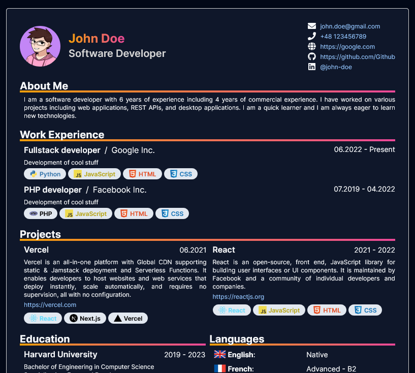

<div align="center">


# CV Template

This is my CV template. It is a simple and clean template that can be used to create a CV. It is based on the [Next.js](https://nextjs.org/) framework and uses [Tailwind CSS](https://tailwindcss.com/) for styling.
</div>

## How to use it?

All settings are stored as environment variables. You can create a `.env.local` file and set your own values. Example values are stored in the `.env.example` file.

```bash
cp .env.example .env.local
# edit .env.local and set your own values
npm run dev
# print page as PDF (use CTRL + P in your browser)
```

# License

This project is licensed under the MIT License - see the [LICENSE](LICENSE) file for details.

tldr: Do whatever you want with it. 😊
